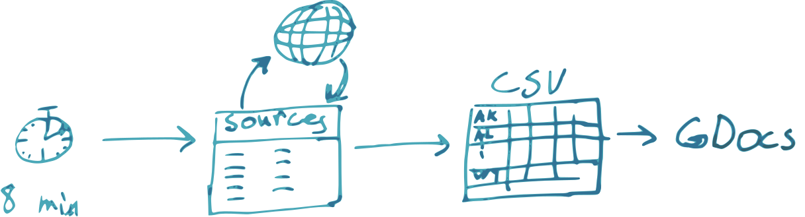
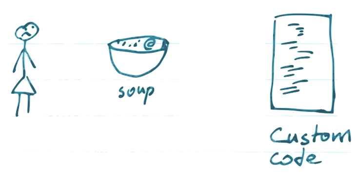

# CoViD-19 Data Fetchers
Fetch COVID19 data published by US states and territories.

The goal of this project is to fetch the most recent covid19 data from US states and territories, and publish them for easy consumption and use for Covid Tracking Project.

## TL;DR

A timed trigger (set to 8 minutes) causes all source queries to be called and collected. The results are aggregated into a CSV file I publish and pushed to a [Google spreadsheet](https://docs.google.com/spreadsheets/d/e/2PACX-1vSpA2ax8_xX-H1bW1dngKD6m82VyDRHOkT7_XzMTVVf1hjoAVgEeM49pPCFQcvnn7-6eAZ0MUEqWkfD/pubhtml#).
Fin.


The biggest value of this repository comes from (1) the list of state data sources and (2) the mapping that maps state-specific property name to a common terminology (e.g., `T_Pos_Count` to `POSITIVE`).


## Long Version

This project started as a way to automate daily covid-19 data entry shifts, using the APIs that back the dashboards states publish.

### Ideal World


I initially listed all `ArcGIS` dashboard and extracted useful layers and quries. I also created a mapping between state terminology to a common terminology, roughly matching CTPs tracked fields (e.g., `T_Pos_Count` to `POSITIVE`).

This was great, I had a list of parameterized queries to run, and a single 20-line program to query and tag everything. Everything worked reliably and quickly, but it wasn't enough.


### Reality
Not all states use `ArcGIS` (too bad). The ones that do, might not have *all* the data in `ArcGIS` and use additional systems.
<br/>


To increase coverage, I added more sources:
* `ArcGIS` (The best! `ckan` has a better API, but `ArcGIS` is easier to explore)
* `CKAN` (used by a couple of states, a good SQL-like API. Powers data.gov)
* Socrata (`soda`, has an OK json API)
* `JSON`
* `CSV` (and zipped `CSV`)
* Excel (xslx) files
* `HTML` -- scraping the page



Pretty much everything requires custom code now (except for the states that use `ArcGIS`).


## Data Entry
What's available

How it's being used

# Running the Code
## Setting up Environment and Running the Scripts
I use `conda` locally and on the server that runs the periodic task. Between `BeautifulSoup`, `Pandas` and libraries to parse Excel files, it's a huge environment.

Get the code
```sh
git clone https://github.com/space-buzzer/covid19-datafetcher.git
cd covid19-datafetcher
```

Create Conda environment
```sh
conda env create -f environment.yml
conda activate c19-data
```

Run scripts
```sh
# python get_my_data.py [STATE_ABBRV

python get_my_data.py
# or
python get_my_data.py MI
```
The output will be in `states.csv`


## Publishing Flow

There are a few `cron` triggered workflows:
- Fetch the repository from GitHub and fast-forward it (set to 1h now)
- Generate the [index page with source links](https://notbroken.dev/covid19/) 
- Run the script (set to 8 min now)
- (After running) push the `csv` to Google Spreadsheets (code not in this repo, TBD to publish)
