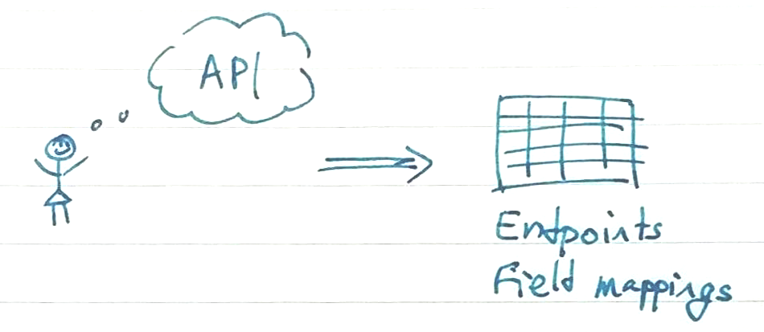

**As of March 7, 2021 we are [no longer collecting new data](https://covidtracking.com/analysis-updates/giving-thanks-and-looking-ahead-our-data-collection-work-is-done). [Learn about available federal data](https://covidtracking.com/analysis-updates/federal-covid-data-101-how-to-find-data).**

---

# COVID-19 Data Fetchers
Fetch COVID19 data published by US states and territories.

The goal of this project is to fetch the most recent covid19 data from US states and territories, and publish them for easy consumption and use for Covid Tracking Project.

For context, the data collection project started under the following assumptions:
1. The data to collect is always structured, and comes from APIs dedicated for this task
2. It’s a short term fix, intended to run for a month, at most two months, but not more  

Both assumptions were broken pretty quickly


## TL;DR

A timed trigger (set to 8 minutes) causes all source queries to be called and collected. The results are aggregated into a CSV file I publish and pushed to a [Google spreadsheet](https://docs.google.com/spreadsheets/d/e/2PACX-1vSpA2ax8_xX-H1bW1dngKD6m82VyDRHOkT7_XzMTVVf1hjoAVgEeM49pPCFQcvnn7-6eAZ0MUEqWkfD/pubhtml#).
Fin.


The biggest value of this repository comes from (1) the list of state data sources and (2) the mapping that maps state-specific property name to a common terminology (e.g., `T_Pos_Count` to `POSITIVE`).


## Long Version

This project started as a way to automate daily covid-19 data entry shifts, using the APIs that back the dashboards states publish.

### Ideal World


I initially listed all `ArcGIS` dashboard and extracted useful layers and quries. I also created a mapping between state terminology to a common terminology, roughly matching CTPs tracked fields (e.g., `T_Pos_Count` to `POSITIVE`).

This was great, I had a list of parameterized queries to run, and a single 20-line program to query and tag everything. Everything worked reliably and quickly, but it wasn't enough.


### Reality
Not all states use `ArcGIS` (too bad). The ones that do, might not have *all* the data in `ArcGIS` and use additional systems.
<br/>


To increase coverage, I added more sources:
* `ArcGIS` (The best! `ckan` has a better API, but `ArcGIS` is easier to explore)
* `CKAN` (used by a couple of states, a good SQL-like API. Powers data.gov)
* Socrata (`soda`, has an OK json API)
* `JSON`
* `CSV` (and zipped `CSV`)
* Excel (xslx) files
* `HTML` -- scraping the page


Pretty much everything requires custom code now (except for the states that use `ArcGIS`).


# Data
The goal of this project is to automatically collect the different datasets we display and aggregate for the project.

There are 3 datasets we're tackling now: the main numbers for states, race-distribution data tracking and historic time series.

In the context of this project, a `dataset` is a collection of sources for each state that include query urls, mappings and auxiliary code (when needed). This is not the actual data being fetched, but the instructions to fetch it.

## Available Datasets
- States (`states`): Covid19 current state data tracking (cases, testing, deaths, etc).
- CRDT (`races`): Covid19 racial data tracking
- Historic Backfill (`backfill`): fetcher for time series data, to handle cases of states that update past days (continuously or one-offs).

## Dataset Structure
Under the root of the project there's a folder called `dataset` with all the supported datasets.  
The general structure is a `yaml` file with the specific dataset config, and a folder by the same name (for easy association) with the actual files defining the dataset.

```sh
dataset
├── {dataset_name}.yaml
└── {dataset_name}
    ├── mappings.yaml
    └── urls.yaml
```

We currently have 3 datasets, and this is how it looks:

```sh
dataset
├── backfill.yaml
├── backfill
│   ├── mappings.yaml
│   └── urls.yaml
├── races.yaml
├── races
│   ├── mappings.yaml
│   └── urls.yaml
├── states.yaml
└── states
    ├── mappings.yaml
    └── urls.yaml
```

Sometimes, there's a need to add special casing in the code (e.g., when scraping a page) and `yaml` files are not enough. Each dataset can define an *extras* module that will handle the parsing of responses when the default parsing is not sufficient.  
By default, the extras module is define as `fetcher.extras.${dataset.name}` which results in a file by the same name as the dataset, in the `fetche/extras` folder.

```yaml
# In the dataset config yaml file:
extras_module: fetcher.extras.${dataset.name}

# To remove the extras module when it's not needed:
extras_module: null
```

# Code
## Setting up Environment and Running the Scripts
I use `conda` locally and on the server that runs the periodic task. Between `BeautifulSoup`, `Pandas` and libraries to parse Excel files, it's a huge environment.

Get the code
```sh
git clone https://github.com/space-buzzer/covid19-datafetcher.git
cd covid19-datafetcher
```

Create Conda environment
```sh
conda env create -f environment.yml
conda activate c19-data
```

Run scripts
```sh
# fetch the default dataset (states) for all states
python get_my_data.py

# fetch the default dataset (states) for the specified state/sates
python get_my_data.py state=CA
# or
python get_my_data.py state=[CA,MT]
```
The output will be in `states.csv`

To fetch a different dataset, use the `dataset=DATASET` argument:
```sh
python get_my_data.py dataset=races
```

## Project Structure
<TODO>

## Publishing Flow

There are a few `cron` triggered workflows:
- Fetch the repository from GitHub and fast-forward it (set to 1h now)
- Generate the [index page with source links](https://notbroken.dev/covid19/) 
- Run the script (set to 8 min now)
- (After running) push the `csv` to Google Spreadsheets (code not in this repo, TBD to publish)
